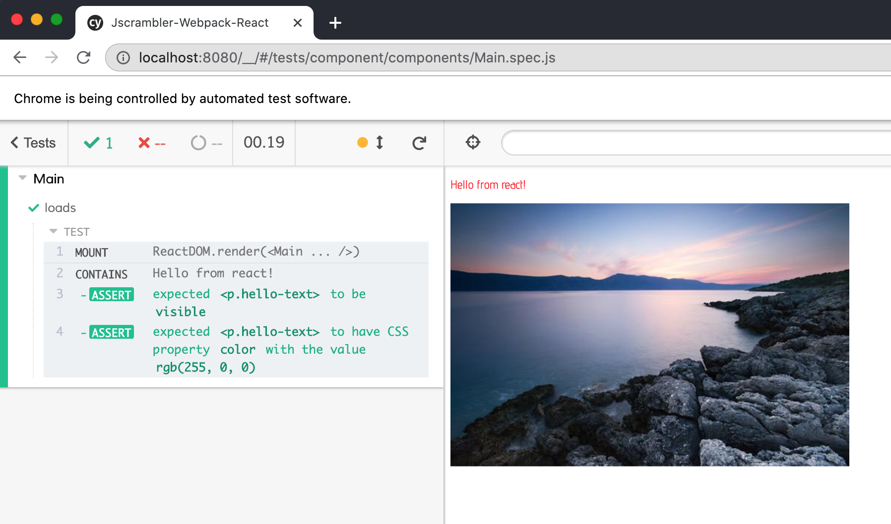

From [Easy Custom Webpack Setup for React.js Applications](https://blog.jscrambler.com/easy-custom-webpack-setup-for-react-js-applications/) repository [JscramblerBlog/Jscrambler-Webpack-React](https://github.com/JscramblerBlog/Jscrambler-Webpack-React)

Example of component testing using Cypress v4.5.0 and [cypress-react-unit-test](https://github.com/bahmutov/cypress-react-unit-test)

See component test in [src/components/Main.spec.js](src/components/Main.spec.js)

The Cypress bundler is using [webpack.config.js](webpack.config.js) from the current project via [cypress/plugins/index.js](cypress/plugins/index.js)
